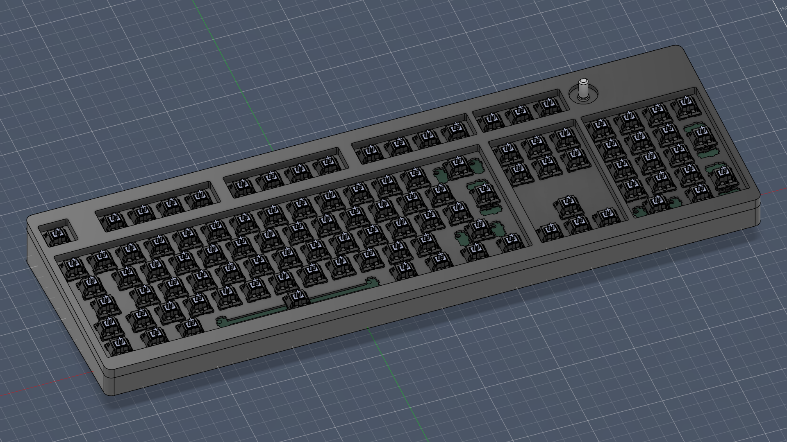
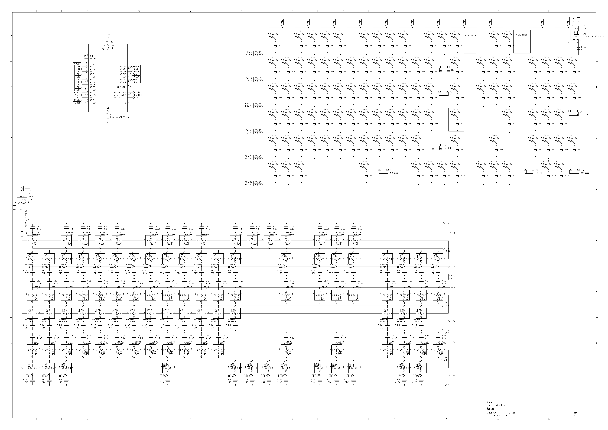
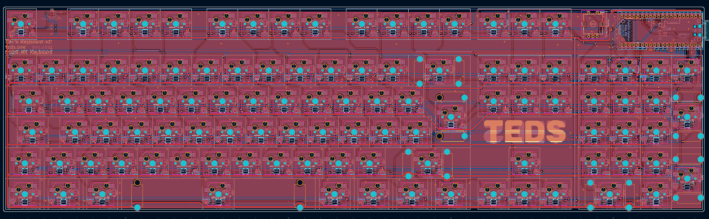
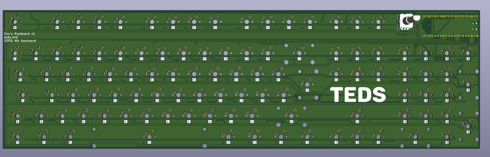
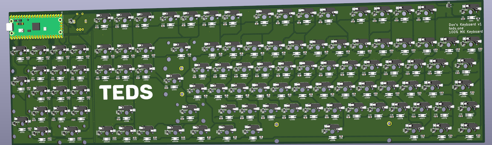

### TEDS KB 100  
  
A 100% ISO-105 Mechanical keyboard - custom PCB, custom case.
It has per-key rgb leds and a rotary encoder. The firmware is written in QMK.

## Bill of Materials
  
Converted using:  
https://www.convertcsv.com/csv-to-markdown.htm
  
|Item                 |Description                                                                                         |Quantity|Unit Price ($)|Total Price ($)|Running Total ($)|URL                                                  |
|---------------------|----------------------------------------------------------------------------------------------------|--------|--------------|---------------|-----------------|-----------------------------------------------------|
|PCB                  |PCB (Minimum order of 5, includes $13.06 global direct line shipping, and $7.62 tax + duties)       |1       |$45.68        |$45.68         |$45.68           |https://jlcpcb.com                                   |
|                     |                                                                                                    |        |              |$0.00          |$45.68           |                                                     |
|Aliexpress           |Shipping                                                                                            |1       |$7.39         |$7.39          |$53.07           |                                                     |
|Pi Pico Board        |RP2040 Devboard / Pico Clone                                                                        |1       |$0.99         |$0.99          |$54.06           |https://www.aliexpress.com/item/1005007393927221.html|
|Hotswap Sockets      |110x Kailh Hot-swappable PCB Socket Hot Plug                                                        |1       |$7.00         |$7.00          |$61.06           |https://www.aliexpress.com/item/1005007232040760.html|
|SN74LV1T125DBVR      |Level Shifter                                                                                       |1       |$2.95         |$2.95          |$64.01           |https://www.aliexpress.com/item/1005008580415329.html|
|SK6812MINI-E         |LEDs (100x)                                                                                         |1       |$4.00         |$4.00          |$68.01           |https://www.aliexpress.com/item/1005010491444748     |
|SK6812MINI-E         |LEDs (50x) (cheapest way to get 110)                                                                |1       |$0.99         |$0.99          |$69.00           |https://www.aliexpress.com/item/1005010491444748     |
|100nF 0805 Capactitor|Decoupling capacitors (2x100pcs)                                                                    |2       |$0.86         |$1.72          |$70.72           |https://www.aliexpress.com/item/1005006478652596.html|
|Rotary Encoder       |EC11 Rotary Encoder                                                                                 |1       |$1.75         |$1.75          |$72.47           |https://www.aliexpress.com/item/1005007501712487.html|
|Diode                |100x                                                                                                |1       |$0.99         |$0.99          |$73.46           |https://www.aliexpress.com/item/1005005574663623.html|
|Diode                |50x                                                                                                 |1       |$0.53         |$0.53          |$73.99           |https://www.aliexpress.com/item/1005008841989543.html|
|Keycaps              |136 Key Black Side-lit Shine Through Backlit Keycaps                                                |1       |$9.42         |$9.42          |$83.41           |https://www.aliexpress.com/item/1005005799148318.html|
|Switches             |Kailh Speed Sliver                                                                                  |1       |$20.82        |$20.82         |$104.23          |https://www.aliexpress.com/item/1005003436102892.html|
|Resistors            |330 Ohm 0805                                                                                        |1       |$0.99         |$0.99          |$105.22          |https://www.aliexpress.com/item/1005002991938153.html|
|M3 Heatset inserts   |                                                                                                    |1       |$1.12         |$1.12          |$106.34          |https://www.aliexpress.com/item/1005008878670633.html|
|M3 Screws            |1 set of 8mm, 1 set of 12mm                                                                         |2       |$1.69         |$3.38          |$109.72          |https://www.aliexpress.com/item/1005007593838226.html|
|Case Shipping        |InPost Medium                                                                                       |1       |$4.00         |$4.00          |$113.72          |                                                     |
|                     |                                                                                                    |        |              |               |                 |                                                     |
|                     |Due to the nature of Aliexpress and their very annoying "deals", prices aren't final and may change.|        |Total Price   |$113.72        |                 |                                                     |
