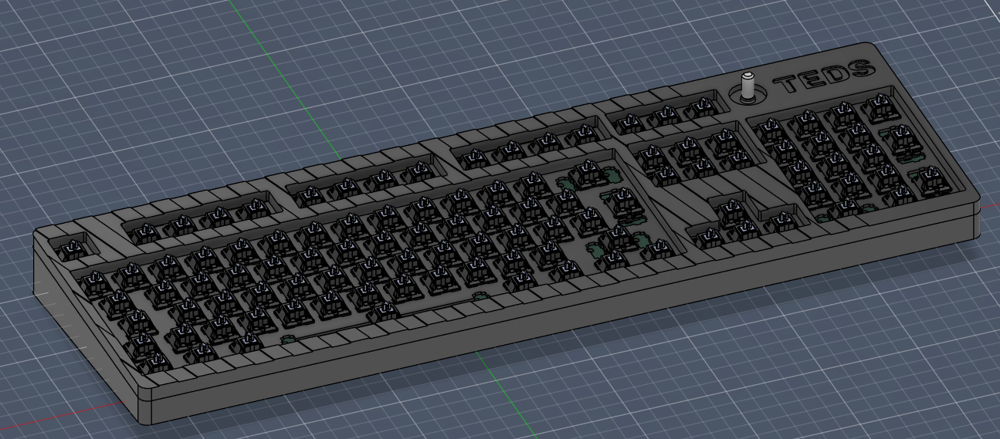
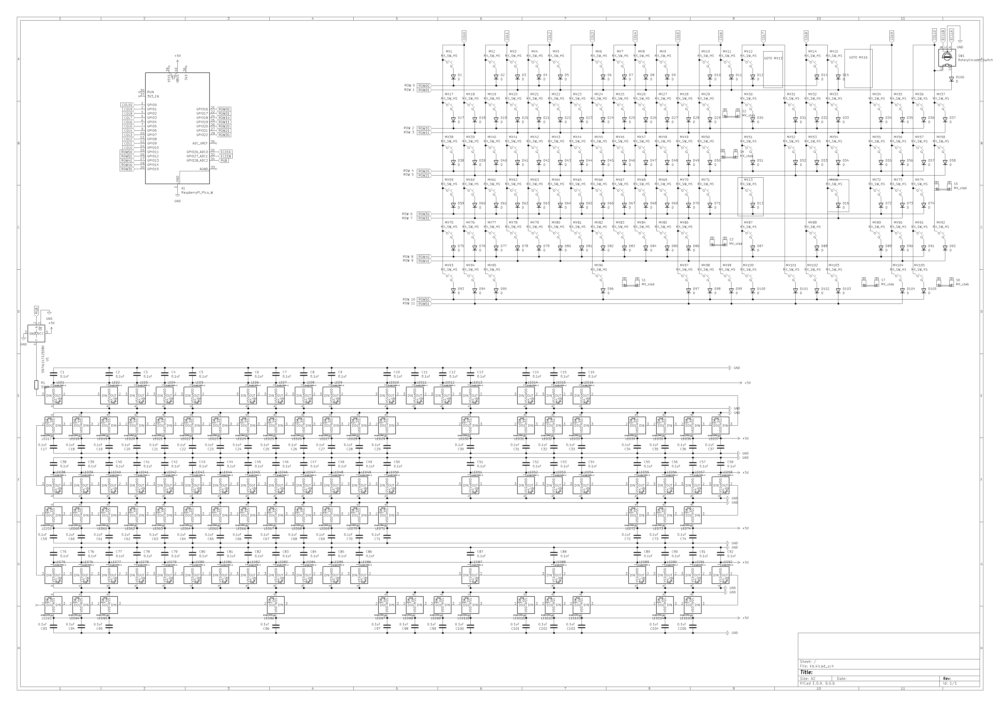
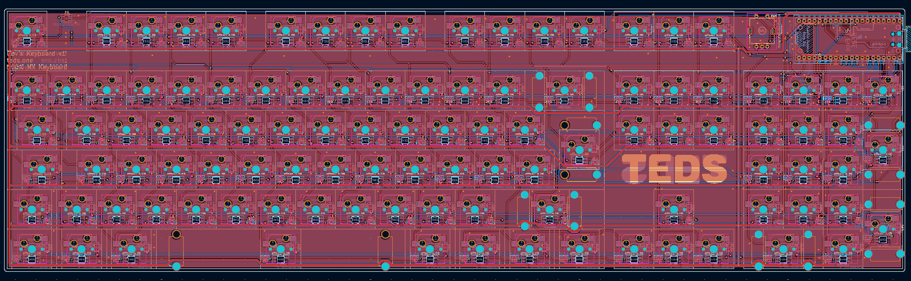
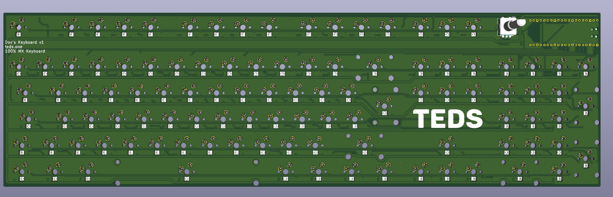
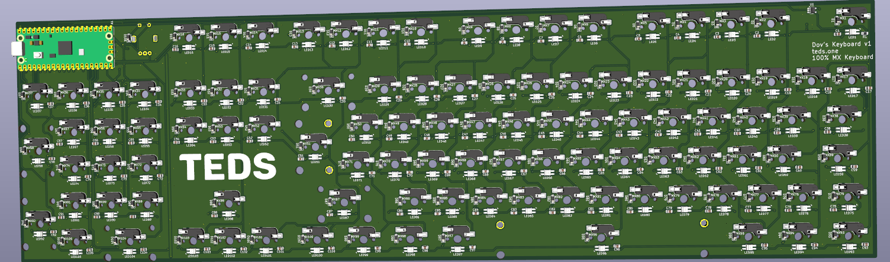

# TEDS KB 100  
  
A 100% ISO-105 Mechanical keyboard - custom PCB, custom case.
It has per-key rgb leds and a rotary encoder. The firmware is written in QMK.

## How to build

  Flash the RP2040 / pi pico devboard with the firmware by holding the boot button and then plugging it into a computer. Then drag the firmware into a drive that appears.  
  When assembling, make sure you solder all of the components to the PCB, but don't insert the switches. First attach the plate, then add the switches into the hotswap sockets, or solder them if you choose not to include them.  
  Then screw the plate to the base, and finally, screw the top. All screws / bolts should be M3. The shorter M3 screws attach the plate to the base while the longer screws attach the top to the bottom. The top plate is optional, and it should work without it.  

## Why did I make this project?  

  Most mechanical gaming keyboards are... mediocre. Firmware that sucks. Software that sucks more. And they all lack one feature or another.  
  And many mechanical keyboards focus on... 60% and TKL. I haven't seen as much focus on cusom 100% keyboards. This is why I decided to make one! (Also since I'm using a membrane keyboard currently...)

## Bill of Materials
  
|Item              |Description                                                                                  |Amount (no MOQ)|Amount (per quantity)|Quantity|Unit Price|Total Price|Running Total|URL                                                                |LCSC Part No|
|------------------|---------------------------------------------------------------------------------------------|---------------|---------------------|--------|----------|-----------|-------------|-------------------------------------------------------------------|------------|
|PCB               |PCB (Minimum order of 5, includes $13.06 global direct line shipping, and $7.62 tax + duties)|1              |5                    |1       |$45.68    |$45.68     |$45.68       |[JLCPCB](https://jlcpcb.com)                                       |            |
|                  |                                                                                             |               |                     |        |          |           |             |                                                                   |            |
|LCSC              |Total: 12.7692 + shipping fees                                                               |               |                     |        |          |           |             |                                                                   |            |
|SK6812MINI-E      |Backlight LEDs                                                                               |105            |1                    |105     |$0.07     |$7.27      |$52.95       |[C5149201](https://www.lcsc.com/product-detail/C5149201.html)      |C5149201    |
|SN74LV1T125DBVR   |Level Shifter                                                                                |1              |1                    |5       |$0.20     |$0.98      |$53.93       |[C473338](https://www.lcsc.com/product-detail/C473338.html)        |C473338     |
|CC0805KRX7R9BB104 |100nF �10% 50V Ceramic Capacitor 0805                                                        |105            |1                    |200     |$0.01     |$1.30      |$55.23       |[C49678](https://www.lcsc.com/product-detail/C49678.html)          |C49678      |
|1N4148W           |Diodes Surface Mount SOD-123                                                                 |105            |1                    |200     |$0.01     |$1.16      |$56.39       |[C917030](https://www.lcsc.com/product-detail/C917030.html)        |C917030     |
|0805W8F3300T5E    |330? �1% 125mW 0805 Thick Film Resisto                                                       |1              |1                    |105     |$0.00     |$0.29      |$56.68       |[C17630](https://www.lcsc.com/product-detail/C17630.html)          |C17630      |
|EC11E09244BS      |Rotary Encoder EC11                                                                          |1              |1                    |1       |$1.77     |$1.77      |$58.45       |[C470742](https://www.lcsc.com/product-detail/C470742.html)        |C470742     |
|                  |                                                                                             |               |                     |        |          |           |             |                                                                   |            |
|AliExpress        |Total: 55.17 + shipping fees                                                                 |               |                     |        |          |           |             |                                                                   |            |
|Pi Pico Board     |RP2040 Devboard / Pico Clone                                                                 |1              |1                    |1       |$2.73     |$2.73      |$61.18       |[AliExpress](https://www.aliexpress.com/item/1005007393927221.html)|            |
|Hotswap MX Sockets|110x Kailh Hot-swappable PCB Socket Hot Plug                                                 |105            |110                  |1       |$6.65     |$6.65      |$67.83       |[AliExpress](https://www.aliexpress.com/item/1005007232040760.html)|            |
|Switches          |Kailh Speed Sliver                                                                           |105            |110                  |1       |$19.41    |$19.41     |$87.24       |[AliExpress](https://www.aliexpress.com/item/1005003436102892.html)|            |
|Keycaps           |135 Keycaps Shine-through (Lucky Red colour)                                                 |105            |135                  |1       |$13.54    |$13.54     |$100.78      |[AliExpress](https://www.aliexpress.com/item/1005010510805160.html)|            |
|M3 Heatset Inserts|Length 3mm 50pcs,�M3(OD4.2mm)                                                                |18             |50                   |1       |$1.87     |$1.87      |$102.65      |[AliExpress](https://www.aliexpress.com/item/1005003582355741.html)|            |
|M3 Screws         |M3 50pcs,�12mm                                                                               |18             |50                   |1       |$1.87     |$1.87      |$104.52      |[AliExpress](https://www.aliexpress.com/item/1005007264845313.html)|            |
|Stabilisers       |Durock Stabilisers V3 BS 7x2u 1x6.25u                                                        |1              |1                    |1       |$6.74     |$6.74      |$111.26      |[AliExpress](https://www.aliexpress.com/item/1005006528731543.html)|            |
|Encoder Knob      |Red Enoder Knob                                                                              |1              |1                    |1       |$2.36     |$2.36      |$113.62      |[AliExpress](https://www.aliexpress.com/item/1005009263732468.html)|            |
|                  |                                                                                             |               |                     |        |          |           |             |                                                                   |            |
|                  |                                                                                             |               |                     |        |          |Total:     |$113.62      |                                                                   |            |
